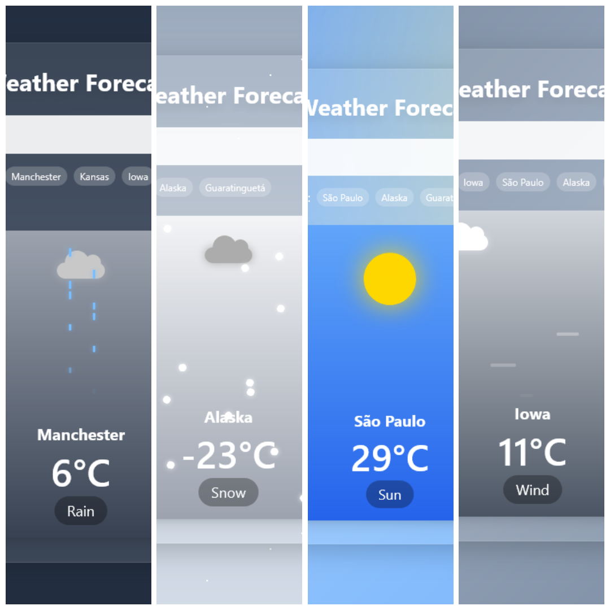

# 🌤️ Projeto Weather App

👋 **Olá!**

Este é um projeto desenvolvido com React, Typescript, TailwindCSS e Framer Motion que utiliza a API da [OpenWeather](https://openweathermap.org/) para buscar informações climáticas. Cada condição climática muda o plano de fundo e as animações das cards.

---

## 📸 Screenshot da API

Aqui está uma prévia da API em funcionamento:  

---

## 🎯 Objetivo

Este projeto foi criado por **curiosidade** e com fins de **estudo**, permitindo a prática de integração de APIs externas.

---

## 🚀 Hospedagem

O projeto está **hospedado no Vercel** e pode ser acessado através do link:  
🔗 [**Acessar o projeto no Vercel**](https://henrikku-weather-app.vercel.app/)

---

## 🛠️ Tecnologias Utilizadas

- **React**
- **Typescript**
- **Tailwind**
- **Framer Motion**
