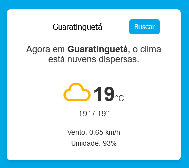

# 🌤️ Projeto Weather App

👋 **Olá!**

Este é um projeto simples desenvolvido com **JavaScript puro** que utiliza a API da [OpenWeather](https://openweathermap.org/) para buscar informações climáticas. Para proteger a **chave da API**, foi implementado um **mini-backend** usando **Serverless Functions** (Vercel) que realiza as requisições em segurança.

---

## 📸 Screenshot da API
Aqui está uma prévia da API em funcionamento:  

---

## 🎯 Objetivo
Este projeto foi criado por **curiosidade** e com fins de **estudo**, permitindo a prática de integração de APIs externas e a utilização de backends leves.

---

## 🚀 Hospedagem
O projeto está **hospedado no Vercel** e pode ser acessado através do link:  
🔗 [**Acessar o projeto no Vercel**](#https://henrikku-weather-emns3fyub-leonardo-henriques-projects-a75fccf7.vercel.app/)

---

## 🛠️ Tecnologias Utilizadas
- **HTML5** e **CSS3** para estrutura e estilo.
- **JavaScript** para a lógica do cliente.
- **Node.js** com **Express** (Serverless)
